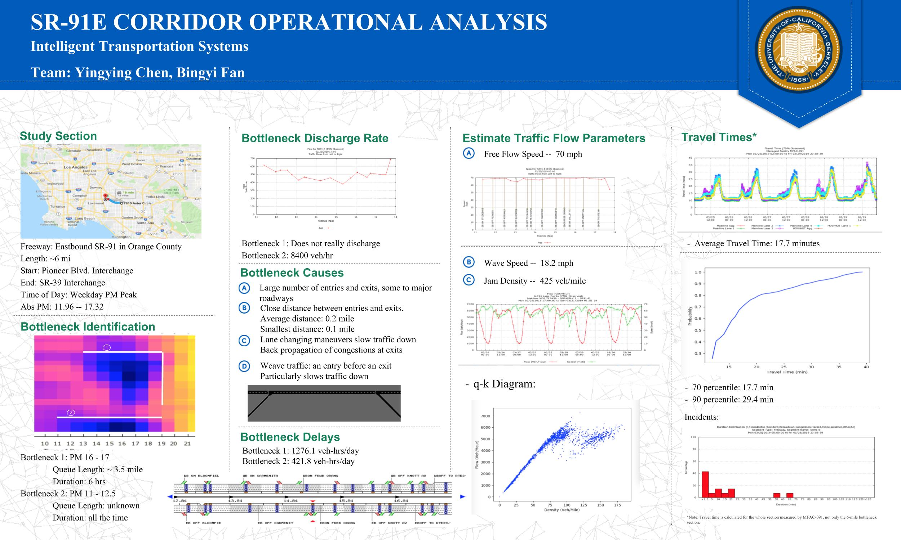

## FREEWAY CORRIDOR OPERATIONAL ANALYSIS -- SR-91E

##### Yingying Chen, Bingyi Fan   
#### UCB-253-2019-4

In this project, we performed a freeway operational data analysis using the freeway performance measurement system (PeMS) database. 

This project consists of two main parts:
- bottleneck identification
- analysis of corridor traffic performance.

